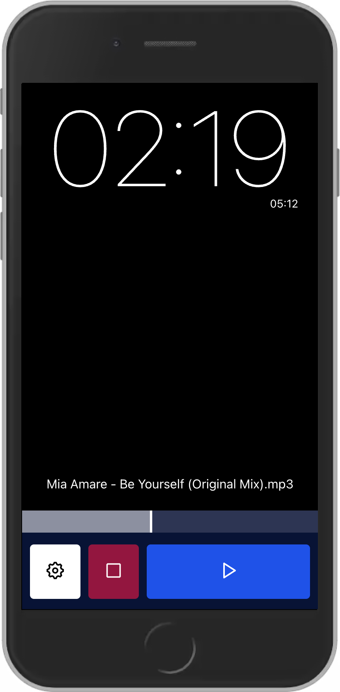
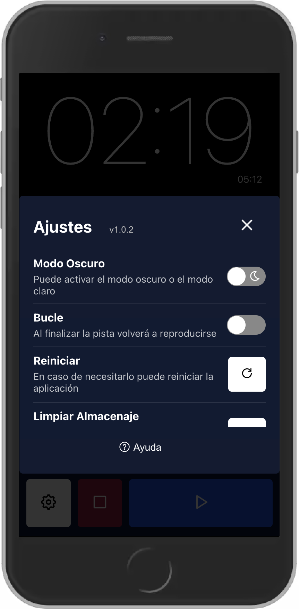

<div id="top"></div>

[![LinkedIn][linkedin-shield]][linkedin-url]

<!-- PROJECT LOGO -->
<br />
<div align="center">
  <a href="https://github.com/github_username/repo_name">
    
  </a>

<h3 align="center">BigTime</h3>

  <p align="center">
    BigTime born from the request of a friend of mine. He needed an app to load a song and see the current time in big size.
    <br />
    <a href="https://bigtime.surge.sh/">View Demo</a>
  </p>
</div>


<!-- TABLE OF CONTENTS -->
<details>
  <summary>Table of Contents</summary>
  <ol>
    <li>
      <a href="#about-the-project">About The Project</a>
      <ul>
        <li><a href="#built-with">Built With</a></li>
      </ul>
    </li>
    <li>
      <a href="#getting-started">Getting Started</a>
      <ul>
        <li><a href="#prerequisites">Installation and Startup</a></li>
      </ul>
    </li>
    <li><a href="#usage">Usage</a>
      <ul>
        <li><a href="#prerequisites">Load and play</a></li>
        <li><a href="#prerequisites">Settings</a></li>
      </ul>
    </li>
    <li><a href="#license">License</a></li>
    <li><a href="#contact">Contact</a></li>
  </ol>
</details>


<!-- ABOUT THE PROJECT -->
## About The Project
<div align="center">
   
</div>
<br>
<br>
<p>A friend of mine asked me if I knew an app that can load a song and display the current time in a fullscreen mode. He's a musician and he needed an app with that funcionality to complete his career thesis. When I told him that I could develop that he needed then he added this process as a part of the thesis and give an extra to it.
</p>
<p>
This was my first app in ReactJS so I wanted to try the "old way" using class components and lifecilge hooks such as <strong>componentDidMount()</strong> but this only for the App.js component. The rest of components were made with functions and hooks.
</p>

<p align="right">(<a href="#top">back to top</a>)</p>


### Built With

* [React.js](https://reactjs.org/)

<p align="right">(<a href="#top">back to top</a>)</p>


<!-- GETTING STARTED -->
## Getting Started

This app is made with create-react-app so the installation process is simple.

### Installation and Startup

1. Clone the repo
   ```sh
   git clone https://github.com/mocca-dev/bigtime.git
   ```
2. Install NPM packages
   ```sh
   npm install
   ```
3. Finally you have to simply run the app and you're ready to go. Enjoy!
   ```sh
   npm start
   ```

<p align="right">(<a href="#top">back to top</a>)</p>


<!-- USAGE EXAMPLES -->
## Usage

### Load and play

The key feature of this app is to reproduce a song and show the current time in big size. To do that, you have to specify the song file to the app. Simply, select the file and load it, then you can click on play and see how the song reproduce it and the time shows up.

### Settings

<div  align="center">
  
</div>
<br>

The app has few settings that you can access to customize some features just clicking in the ⚙️  button: 
<ul>
  <li>
    Change the <strong>theme</strong> to Dark or Light to avoid eye damage. 
  </li>
  <li>
    <strong>Loop</strong>: If you set loop on, when the song finish will start again.
  </li>
  <li>
    <strong>Reboot</strong>: You can reboot the entire app with this action.
  </li>
  <li>
    <strong>Clean storage</strong>: It will delete the internal storage deleting the current song.
  </li>
</ul>


<p align="right">(<a href="#top">back to top</a>)</p>


<!-- LICENSE -->
## License

Distributed under the MIT License. See `LICENSE.txt` for more information.

<p align="right">(<a href="#top">back to top</a>)</p>


<!-- CONTACT -->
## Contact

Nicolás Tonelli - nicolastonelli1406@gmail.com

Project Link: [https://github.com/mocca-dev/bigtime.git](https://github.com/mocca-dev/bigtime.git)

<p align="right">(<a href="#top">back to top</a>)</p>


<!-- MARKDOWN LINKS & IMAGES -->
<!-- https://www.markdownguide.org/basic-syntax/#reference-style-links -->
[contributors-shield]: https://img.shields.io/github/contributors/github_username/repo_name.svg?style=for-the-badge
[contributors-url]: https://github.com/github_username/repo_name/graphs/contributors
[forks-shield]: https://img.shields.io/github/forks/github_username/repo_name.svg?style=for-the-badge
[forks-url]: https://github.com/github_username/repo_name/network/members
[stars-shield]: https://img.shields.io/github/stars/github_username/repo_name.svg?style=for-the-badge
[stars-url]: https://github.com/github_username/repo_name/stargazers
[issues-shield]: https://img.shields.io/github/issues/github_username/repo_name.svg?style=for-the-badge
[issues-url]: https://github.com/github_username/repo_name/issues
[license-shield]: https://img.shields.io/github/license/github_username/repo_name.svg?style=for-the-badge
[license-url]: https://github.com/github_username/repo_name/blob/master/LICENSE.txt
[linkedin-shield]: https://img.shields.io/badge/-LinkedIn-black.svg?style=for-the-badge&logo=linkedin&colorB=555
[linkedin-url]: https://linkedin.com/in//nicolás-tonelli-181624b9/
[product-screenshot]: images/screenshot.png
